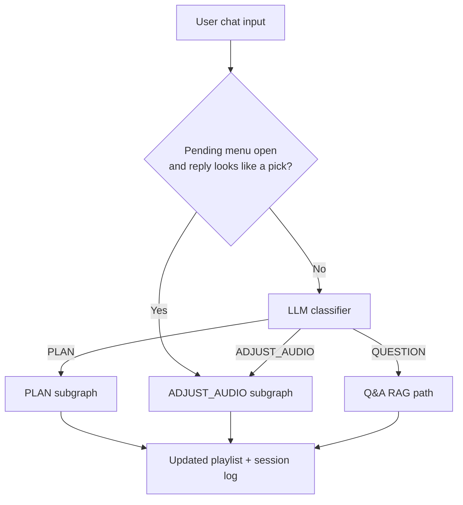
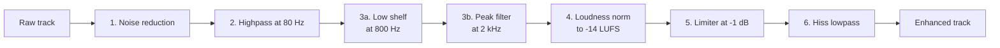
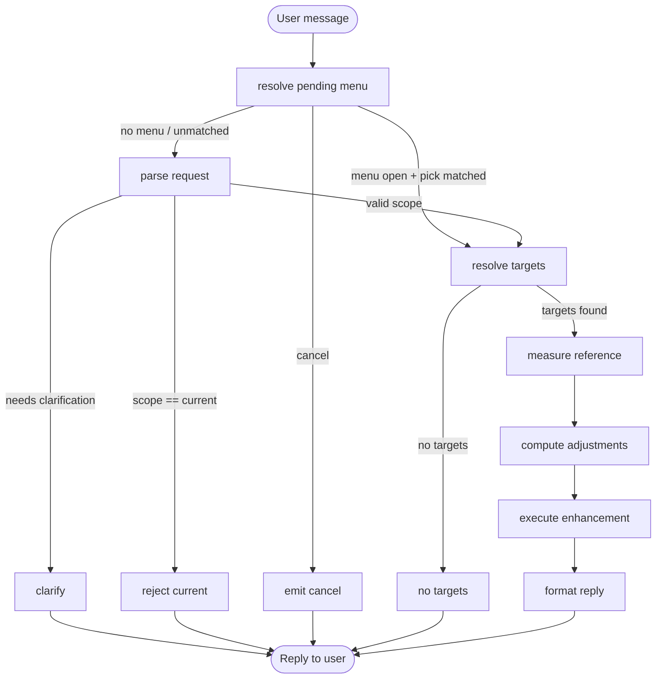

# Methodology

This section describes the AT-DJ system from the outside in. It first walks through the UI panels a user sees, then opens up the agent that powers the chat box, then dives into the audio-enhancement workflow that is the project's main contribution. Two of the three chat workflows (PLAN and Q&A) are documented at a high level and detailed in the teammates' sections; this draft owns the audio-enhancement workflow end to end.

---

## 1. UI Frontend Functional Sections

The application is a single Streamlit page laid out as a sidebar plus four side-by-side main panels above a search panel along the bottom. Every panel below is described from the user's perspective; the agent chat panel is named here for completeness but its behaviour is documented in Section 2.

### 1.1 Sidebar — Settings

The sidebar carries a small settings panel where the user picks an LLM provider (Claude or Gemini), picks a model from a provider-specific list, and pastes an API key. A Save Settings button writes the choices into the running session so subsequent chat turns use them. Switching provider follows a deliberate three-step flow: change provider, pick a model from the now-refreshed list, re-enter the key, then save. This avoids the silent failure of a previously saved Claude model name being reused for Gemini. The key is held only in session state and is not persisted to disk.

### 1.2 Now Playing card

A compact card showing the title, orchestra, singer, decade, and style of the track that is currently playing. When nothing is loaded, the card shows a dashed placeholder telling the user to plan a session to get started. The card is driven by the playback queue's current cursor position, so it stays consistent with the audio that is actually being served.

### 1.3 Custom Audio Player and Playback Controls

The audio player is a custom HTML and JavaScript component embedded in the page. It was custom-built rather than using Streamlit's native audio widget so that playback survives Streamlit reruns: when the user moves a slider or sends a chat message, the page re-renders, but the audio iframe keeps playing without restart. The component handles playback, volume, auto-advance to the next track, missing-file skip, and a configurable transition gap between songs and a configurable cortina cut-off length. Playback never autoplays on cold load — the user must click play once per session, after which subsequent track-to-track transitions auto-advance.

Two transport sliders sit next to the player. The Transition slider sets the gap inserted between consecutive tracks, and the Cortina slider sets the maximum cortina playback length. Both sliders live inside a fragment-scoped section so that dragging them does not interrupt the currently playing track; the new value applies cleanly at the next transition or the next cortina cut-off.

### 1.4 Energy Arc chart

An Altair chart that plots the planned energy curve of the current session. Each song is a dot whose y-position is the catalog energy value for that track. Cortinas, which carry no energy value, appear as hollow squares whose y-position is interpolated between neighbouring song anchors so the chart line stays smooth. Dot colour reflects playback state: tracks already played turn blue; upcoming tracks remain grey. Hovering a dot reveals a tooltip with the song title, orchestra, singer, decade, and style.

### 1.5 Full Playlist

A scrollable list of every item the agent has queued, broken into tandas separated by cortina rows. Each row carries reorder buttons (move up, move down), a remove button, and a play button. Cortina rows display the actual filename of the cortina that will play, not a generic placeholder, so the user can see at a glance which transition the agent picked. The currently playing row is highlighted; its remove button is hidden so the user cannot pull the rug out from under playback.

### 1.6 Agent Chat

The chat panel is the central interaction surface and the entry point for all three agent workflows. It is documented in Section 2.

### 1.7 Session Log

A timestamped list of agent and user activity. The on-screen log shows one user-facing summary line per logical event, while every sub-step is also written to a JSON file on disk for later inspection or replay. Entries are colour-coded by source and severity: blue for agent updates, grey for user actions, amber for warnings (failed plans, no targets, etc.), and red for errors. A small icon at the start of each line distinguishes planning entries (📋), audio entries (🎛), and user actions (👤).

### 1.8 Search Music (Library)

A search box at the bottom of the page that queries the catalog by title or orchestra and returns matches inline. Each result has a plus button that appends it to the end of the playlist. Cortinas surface in the results with a small "C" badge so the user can add them through the same interface.

---

## 2. Agent Chat: End-to-End Architecture

Behind the single chat box sit three subgraphs and a router. When the user submits a message, an LLM classifier reads it and routes it to one of three workflows: PLAN for session planning, ADJUST_AUDIO for chat-driven audio adjustments, and Q&A for tango knowledge questions. Before classification, a lightweight short-circuit checks whether the user has a clarification or rejection menu open and whether the new message looks like a menu pick (a number or a short keyword). If it does, the message is routed straight to ADJUST_AUDIO so the in-flight menu can resolve cleanly without paying for a classifier call.

All three subgraphs share a single typed state object that carries the chat history, the current planning session identity, the planning progress (current tanda index, the per-tanda prompts and the tracks selected for each), feedback fields, the activity log, and meta-flags for retry counts and completion. Conditional edges between nodes route on this state — for example the planner retries on error, the queue publisher decides whether to call the cortina selector next, and the session summary fires only when the session is complete.

The routing was a deliberate choice over a single mega-agent. Each workflow has a different shape (planning is a long stateful sequence; audio adjustment is a short interactive loop with menus; Q&A is a one-shot retrieval call), and forcing them through one large prompt would have made each weaker than its specialized version. The rejection menu in audio adjustment is the same logic taken further — instead of refusing requests that touch the currently playing track, the agent surfaces an alternative the user can pick, which keeps the conversation moving rather than stopping it cold.

---

## 3. Workflows Under Agent Chat

### 3.1 PLAN workflow — *placeholder for teammates*

The PLAN subgraph turns a natural-language session request ("plan a relaxed Di Sarli tango tanda, then a more dramatic Pugliese tanda") into a populated playlist with tandas and cortinas in order. The node sequence is: session initialization, then for each tanda — RAG-backed track selection, cortina selection, queue publication — and finally a session summary. Conditional edges allow a failed tanda to retry once, a cortina to be skipped when the next item is the last tanda, and feedback events to be processed mid-plan.

Teammates to fill in: per-node responsibilities, the selection prompt template, the routing logic, a Mermaid graph analogous to Section 3.3.2, and the corner cases the planner handles — at minimum the no-tracks-found warning path that publishes a "skipped — no tracks" log line instead of inventing tracks, the retry-on-error path, and a multi-tanda example with a cortina inserted between tandas.

#### 3.1.1 Cortina generation — *placeholder for teammate in progress*

Cortina **selection** from the existing backup pool is documented above as part of the PLAN node sequence. Cortina **generation** — constructing fresh transition clips rather than picking from existing files — is a separate piece of work currently being implemented by a teammate. This subsection is reserved for that write-up: how a generated cortina is constructed (splice / crossfade / synthesis), how it slots into the cortina selector node alongside the backup pool, and how the agent decides between selecting from the pool and generating fresh.

### 3.2 Q&A workflow — *placeholder for teammates*

The Q&A path handles tango knowledge questions ("Who is Carlos Di Sarli?", "What is the difference between tango and vals?") through retrieval over a curated tango knowledge base, with Wikipedia as a secondary source and an LLM-only fallback when neither retrieval succeeds. The local knowledge base is consulted first because curated content is more trustworthy and faster than a network call.

Teammates to fill in: the retrieval pipeline, the ChromaDB collection layout, the answer-generation prompt, the disclaimer surfaced when the answer is LLM-only, a Mermaid graph of the retrieval flow, and the corner cases handled — at minimum an empty-retrieval path, a multi-clause query path, and the Q&A-specific behaviours triggered by structured fields like BPM or year.

### 3.3 Audio Enhancement workflow

The audio-enhancement workflow is the project's main contribution. It is presented in two ordered subsections: the DSP foundation comes first because the agent's adjustments are interpreted on top of it; the agent subgraph then sits on that foundation and translates chat into DSP parameters.

#### 3.3.1 DSP Foundation

**The problem we are trying to solve.** Tango recordings span almost a century — from grainy 1930s shellac transfers to 1950s studio masters to recent digital reissues. When a tanda mixes tracks from two or three different recording years, the listener hears jarring jumps: one track is loud, the next is quiet; one has audible tape hiss, the next is dead clean; one sounds dark and warm, the next sounds bright and brittle. A real DJ smooths these out by adjusting EQ knobs and volume between songs. Our enhancement pipeline does the same thing automatically, in software, before a tanda starts playing.

**A short audio glossary** (used through the rest of this section):

- **Frequency** — sounds are made of vibrations at different pitches (low rumble, mid-range, high hiss). The human ear hears roughly 20 Hz to 20,000 Hz.
- **Filter** — a tool that lets some frequencies through and blocks or boosts others. Three filter shapes appear below: a *highpass* (blocks everything below a cutoff), a *low shelf* (boosts a low band by a fixed amount), and a *peak filter* (boosts a single narrow band).
- **Loudness** — the volume the human ear actually perceives, which is not the same as raw signal amplitude. Quiet music with bright cymbals can feel "louder" than loud music with deep bass. Loudness is measured in LUFS (loudness units), where lower numbers mean quieter.
- **Limiter** — a safety brake that catches signal peaks that would otherwise distort and squashes only those peaks down. Different from a volume control, which scales the whole signal.
- **Brightness vs warmth** — informal words for where in the frequency spectrum a track's energy sits. A "bright" track has more high-frequency content and can sound thin. A "warm" track has more low and mid content and can sound full.

**The five stages, in plain language.** Every track goes through the same five steps, in this order:

1. **Noise reduction.** Old recordings carry a constant background of tape hiss, electrical hum, and surface noise from the original 78 rpm pressing. This step listens to the steadiest part of the recording, builds a profile of that "always-there" background, and subtracts it from the rest of the track. Stronger settings remove more noise but also start to hollow out the music; weaker settings keep more music but leave more hiss. The strength is set per track (more aggressive on a track that is much noisier than its neighbours).
2. **Highpass at 80 Hz.** Cuts everything below 80 Hz. There is no real musical content down there in tango — only turntable rumble, mic stand thumps, and recording-room low-end mud. Removing it cleans up the low end without losing any actual music.
3. **EQ shaping in two parts.**
   - **3a. Low shelf at 800 Hz** — a gentle boost across the lower midrange. This is the frequency band where the bandoneón's body lives; boosting it adds warmth without making the track sound boomy.
   - **3b. Peak filter at 2 kHz** — a narrow boost around 2 kHz. This is where the singer's vocal presence lives; lifting this band makes the lyrics sit forward in the mix without making them harsh.
   These two boosts are also set per track — a track that is already warm gets less low-shelf boost; a track that is already bright gets less vocal boost.
4. **Loudness normalization.** Different recordings come out of the studio at very different volumes. Modern remasters are loud; vintage transfers are often very quiet. This step measures each track's loudness in LUFS and adjusts the volume so every track ends up at the same target loudness (-14 LUFS, the standard streaming services use). The result is that the user does not have to ride the volume knob between songs in a tanda.
5. **Limiter at -1 dBFS, then dynamic hiss filter.** The loudness step can boost a quiet track enough that some peaks would clip (digital distortion); the limiter catches just those peaks. Finally, a per-track lowpass filter removes any high-frequency hiss that survived step 1 — the cutoff frequency is set automatically by looking at where the actual musical content of *this particular track* drops off, so a 1935 recording (less high-frequency content) gets a lower cutoff than a 1950 recording (more high-frequency content).

**The adaptive pre-pass — why "per-track" matters.** Before stage 1 even runs, the system looks at all the tracks in the tanda together and asks two questions about each one:

- *How noisy is this track compared to its tanda neighbours?* (computed as a signal-to-noise ratio — how much music is there relative to how much hiss).
- *How bright or dark is this track compared to its tanda neighbours?* (computed as the spectral centroid — a single number describing where the "centre of mass" of the track's energy sits in the frequency spectrum).

Tracks that score noisier than the tanda median get more aggressive noise reduction; tracks that score darker than the median get more warmth boost; tracks that score brighter than the median get more vocal-presence boost. The goal is not to make every track sound the same — it is to *narrow the gap* between the most extreme members of the tanda so the group sounds cohesive without losing the character of any individual recording.

**How a chat phrase becomes a parameter.** When the user says something like "make the next tanda a bit warmer", the agent layer (Section 3.3.2) translates that into a relative DSP instruction. The mapping has three pieces, all small lookup tables:

- The **feature word** in the message (loudness / bass / presence / noise / rumble) selects which knob to turn.
- The **direction word** ("louder", "warmer", "less harsh") chooses up, down, or reset.
- The **magnitude word** ("a bit", "more", "much more") picks small, medium, or large step size.

The agent then walks through every upcoming target track, takes that track's adaptive baseline from the pre-pass, and adds (or subtracts) the step. Crucially, the addition is *constrained per track* — a track that is already very warm cannot be pushed past the warmth ceiling, even if the user asked for "much warmer", because doing so would push it into mud. So the same phrase produces a *bigger* adjustment on a dark track than on a bright track, and the result is consistent in *perceived effect* rather than identical in numeric value. This is what makes the chat layer feel intelligent rather than mechanical: the user gives a relative instruction in plain English; the system translates it into per-track absolute parameters that respect each track's starting point.

#### 3.3.2 Agent Subgraph — ADJUST_AUDIO LangGraph

The audio-adjustment subgraph is a small LangGraph that handles a single chat message end to end. Its job is to turn a natural-language audio request into either a confirmed adjustment, a clarifying question, or an explicit refusal — and to do so without ever modifying the track that is currently playing.

The graph has eleven nodes; their roles are summarized below.

| Node | Role |
|------|------|
| resolve pending menu | First node every message hits. If a clarification or rejection menu is open from the previous turn, this node tries to match the new message against the menu options. On a match it rewrites the scope or carries forward the previous intent and skips ahead. On a cancel keyword it routes to the cancel terminal. On no match it falls through to parse. |
| parse request | Calls the LLM with a structured prompt to extract feature, direction, magnitude, scope, and an optional named target. Returns either a clean parse or a `needs_clarification` flag with a small set of plain-English options. |
| clarify | Terminal node that surfaces a clarifying question with up to four options. The reply on the next turn is handled by resolve pending menu. |
| reject current | Terminal node fired when the user asks to change the track that is currently playing. Surfaces a three-option menu — apply to the rest of the session, apply to the next tanda only, or cancel. |
| resolve targets | Maps the parsed scope onto a list of upcoming track indices in the playlist. Filters out cortinas and never includes the currently playing track. |
| no targets | Terminal node fired when scope resolution returns an empty list — for example if the user asks for "next tanda" and there is no next tanda. |
| measure reference | Reads the parameters of the currently playing track to use as a reference baseline for the relative adjustment. |
| compute adjustments | For each target track, applies the magnitude delta on top of the reference and clamps the result against the track's per-track ceiling so the adjustment is consistent in perceived effect. |
| execute enhancement | Runs the DSP chain from Section 3.3.1 on every target track with the computed parameter overrides and writes the processed files. |
| format reply | Builds the user-facing confirmation message with the count of affected tracks and the direction of change. |
| emit cancel | Terminal node fired when the user cancels a pending menu. Returns "Okay — no adjustment applied." with no side effects. |

**How the conversation stays alive across turns — and how it breaks out cleanly.** A natural worry about a chat-driven system is "what happens between turns?" If the agent asks a clarifying question on turn N, how does it know on turn N+1 that the user's answer belongs to that question rather than starting over? And just as important: what happens if the user changes their mind mid-clarification and asks something completely unrelated? The system handles both with the same mechanism, in two stages.

**Stage 1 — staying in the conversation.** Whenever a node terminates with a clarification or a rejection menu (the *clarify* and *reject current* nodes), it stores a small piece of *pending state* before returning the reply: the question that was just asked, the four-or-fewer options offered, and any partial intent already extracted (the feature, direction, and magnitude the user has hinted at so far). This pending state survives between turns because Streamlit's session state holds it in memory across page renders. When the next user message arrives, the very first node that runs (*resolve pending menu*) reads this state and tries — without calling the LLM — to match the new message against the open menu. The match is heuristic, not strict:

- a single digit `1`/`2`/`3`/`4` → option index;
- words like "first", "second", "third" → option index;
- a substring of any option's text (for example "next tanda" against "Apply to the next tanda only") → option pick;
- a cancel keyword ("cancel", "no", or the cancel-option number) → terminal cancel.

If any of these match, the system rewrites the user's message into the picked option, *carries forward the partial intent the previous turn extracted*, and skips the LLM parse step entirely — the conversation continues with the user's intent fully reconstructed. This is what makes the multi-turn flow feel coherent: turn 1 said "feature is loudness, direction is up, scope is unclear", turn 2 said "next tanda only", and the system silently merges the two into "loudness, up, next tanda" without ever forgetting what turn 1 was about.

**Stage 2 — jumping out cleanly.** The same first node also detects when the user has clearly *abandoned* the menu. Three signals trigger an abandon:

1. The new message is long (more than a short menu pick would be).
2. It contains a verb that matches a different intent — `plan`, `play`, `search`, `who is`, `tell me about`, etc.
3. None of the heuristic match patterns above succeed.

When that happens, the pending state is discarded, the menu is dropped, and the message is routed back through the top-level classifier as if the menu had never been opened. The user's "off-topic" message then runs as a fresh PLAN or Q&A or audio request on its own merits. Concretely: if the user typed "plan a Demare tanda" while a clarification was open, the system sees the verb "plan" and the long sentence, drops the clarification, and runs the planner. The previous audio question is treated as no longer relevant — which matches what the user signalled.

This two-stage design is the answer to the "what about state?" question for the whole subgraph. The pending-state slot is the only memory the conversation needs; the heuristic in *resolve pending menu* is the only logic that decides whether to reuse it or throw it away.

**Design intent — current track is read-only.** The system enforces this in three independent places. The parser may legitimately produce `scope=current` from a sentence like "this song is too loud", and the routing layer redirects that scope to the rejection menu rather than running DSP. The rejection menu itself only offers scopes that affect upcoming tracks. And the target-resolution helper at the bottom of the chain filters its output to indices strictly greater than the current playback position, so even a buggy upstream cannot reach the playing track. The reason for this hard constraint is mechanical, not philosophical: rewriting the file that is currently being streamed to the audio element would interrupt playback, defeating the whole point of a chat-driven adjustment system.

**Worked example.** A typical full-circle interaction starts with the user saying "Make the current song louder." Resolve pending menu sees no open menu and falls through. Parse extracts feature loudness, direction up, scope current. The router sees scope current and routes to reject current, which surfaces the three-option menu and the reply is shown to the user. On the next turn the user replies "2". Resolve pending menu now sees the rejection menu open, matches "2" to "next tanda only", rewrites the scope to next tanda, and skips parse to land on resolve targets. Resolve targets finds the four upcoming-tanda track indices. Measure reference reads the loudness of the currently playing track. Compute adjustments adds the magnitude delta to that loudness baseline, clamped per track. Execute enhancement runs the DSP chain on those four tracks with the new loudness target. Format reply confirms the result.

**Scenario and corner-case coverage.** A core selling point of this subgraph is the breadth of edge cases it handles cleanly, not just the happy path. Today the subgraph covers ten distinct scenarios, listed below with a worked example for each. In every example, **U:** is the user's message, **A:** is the agent's reply, and the *Behind the scenes* line summarizes what the graph did.

**1. Happy-path direct apply** — clean parse, valid upcoming scope, immediate enhancement, confirmation in chat.

> **U:** the current tanda sounds a bit too harsh, fix the next one
> **A:** Slightly reduced vocal presence for 1 track.
>
> *Behind the scenes:* parse → resolve targets (next tanda) → measure reference → compute adjustments → execute → format reply.

**2. Clarification when ambiguous** — a vague message produces a menu of plain-English options. The user picks an option, the graph re-enters with the disambiguated intent, and the conversation does not loop.

> **U:** it sounds a bit off
> **A:** It sounds a bit off — can you tell me more about what's bothering you?
>   1. Too loud or too quiet
>   2. Too much bass / too boomy
>   3. Vocals unclear or too harsh
>   4. Background hiss or noise
> **U:** 1
> **A:** Should I turn the volume up or down, and by how much?
>   1. A bit quieter
>   2. Much quieter
>   3. A bit louder
>   4. Much louder
>
> *Behind the scenes:* parse → clarify (terminal). Next turn: resolve pending menu matches "1" → re-runs parse with the disambiguated text → focused follow-up clarification. The graph converges on each reply rather than asking the same question again.

**3. Cancel mid-flow** — at any rejection or clarification menu the user can reply with the word "cancel" or the cancel-option number; the graph terminates at the cancel node with no side effects.

> **U:** this song is too loud
> **A:** Cannot modify a track that is already playing. Would you like to:
>   1. Apply to all songs after this one (rest of session)
>   2. Apply to the next tanda only
>   3. Cancel
> **U:** 3
> **A:** Okay — no adjustment applied.
>
> *Behind the scenes:* parse → reject current. Next turn: resolve pending menu matches "3" → emit cancel (terminal). No DSP runs.

**4. Current-track read-only enforcement** — an explicit attempt to change the playing song surfaces the rejection menu; on the user's pick, the original feature, direction, and magnitude are carried forward to the new scope automatically.

> **U:** this song is too loud
> **A:** Cannot modify a track that is already playing. Would you like to:
>   1. Apply to all songs after this one (rest of session)
>   2. Apply to the next tanda only
>   3. Cancel
> **U:** 2
> **A:** Moderately reduced loudness for 4 tracks.
>
> *Behind the scenes:* parse → reject current (carries `feature=loudness, direction=down` into pending state). Next turn: resolve pending menu matches "2" → rewrites scope to next tanda → resolve targets → measure → compute → execute → format reply.

**5. No targets after scope resolution** — a request that names a scope which contains zero upcoming tracks terminates at a no-targets warning instead of running DSP on nothing.

> *Setup:* the playlist contains only the currently-playing tanda; there is no next tanda yet.
> **U:** boost the bass on the next tanda
> **A:** No tracks to adjust — nothing matched after the current position.
>
> *Behind the scenes:* parse → resolve targets returns empty list → no targets (terminal). The session log records a warning so the user can see why nothing happened.

**6. Reset path** — phrases like "back to default", "use original", and "undo my changes" all map to a reset direction, which deletes any processed files for the affected tracks so the originals play next time.

> **U:** back to default for the next tanda
> **A:** Reverted 4 tracks to their default adaptive enhancement.
>
> *Behind the scenes:* parse extracts `direction=reset` regardless of which feature was last touched → resolve targets → execute (delete-overrides path) → format reply. No measurement needed.

**7. Off-topic interrupt during a pending menu** — if a clarification or rejection menu is open and the user types something that clearly is not a menu pick (a long sentence, a new PLAN request, a knowledge question), the graph detects this, drops the stale menu, and routes the message back through the top-level classifier.

> *Setup:* the previous turn left a clarification menu open ("it sounds a bit off", four options).
> **U:** plan a Demare tanda
> **A:** ✅ Done! I've planned 4 tracks. Orchestras: Lucio Demare. Styles: TANGO.
>
> *Behind the scenes:* the menu-pick heuristic sees a long message containing the verb "plan" → clears the pending adjustment → message routes through the classifier, lands on PLAN, and executes a fresh planning call. The original audio-clarification context is discarded as intended.

**8. Free-form answer not in the option list** — if the user replies to a clarification with text that does not match any of the offered options, the graph re-runs the parse step on the new text rather than treating the reply as a failed menu pick.

> *Setup:* the previous turn offered four loudness/bass/presence/noise options.
> **U:** actually just less hiss
> **A:** Moderately reduced noise for 4 tracks.
>
> *Behind the scenes:* resolve pending menu finds no substring or numeric match → falls through to parse → parse re-runs on the new text → resolves to `feature=noise, direction=down, magnitude=medium` → standard execute path.

**9. Unsupported feature** — a request for something the system does not model is either redirected to the closest legal feature in the parse step or surfaces a clean clarification, never silently coerced into a wrong feature.

> **U:** make the next tanda more sparkly
> **A:** Slightly increased vocal presence for 4 tracks.
>
> *Behind the scenes:* parse maps "sparkly" to the closest legal feature (presence). The covering test (`test_unsupported_feature_clarifies_gracefully`) asserts the LLM either redirects to the closest legal feature like this, or returns a clarification — but never invents a feature name silently.

**10. Missing audio file or measurement failure** — if the reference track cannot be read or measured, the chain falls back to default parameters and continues rather than crashing the whole turn.

> *Setup:* the currently-playing track's file is missing from disk.
> **U:** make the next tanda a bit warmer
> **A:** Slightly increased bass for 4 tracks.
>
> *Behind the scenes:* measure reference fails to open the file → falls back to the system default reference parameters → compute adjustments and execute proceed normally → a warning is written to the JSON session log so the failure is visible after the fact.

These ten scenarios are what take the subgraph from a happy-path demo to a system that survives real chat use. Any one of them, on its own, would be the easy thing to skip; together they are the difference between an agent that works and an agent that frustrates the user on the first surprise.

---

## 4. State Propagation and Session Logging

The previous sections describe what each node *does*. This section describes how the nodes *communicate*: how information flows between them, and how that flow is observed both at runtime (in the on-screen Session Log) and after the fact (in a structured JSON file). The two topics belong together because the log is the user-visible trace of the same state object that drives every routing decision.

### 4.1 The shared state object

Every workflow described above runs on a single typed state object that is the spine of the agent. The state holds, at any point during a chat turn:

- the running chat history (every user message and every agent reply so far);
- the planning progress when a PLAN is in flight (which tanda is being planned, the per-tanda prompts handed in from the UI, the tracks selected for each tanda, the cortina chosen between them);
- the audio-adjustment progress when an ADJUST_AUDIO request is in flight (the parsed feature, direction, magnitude, scope, and target list; the reference parameters measured from the currently-playing track; the per-track parameter overrides computed for the upcoming tracks);
- the pending-menu slot described in Section 3.3.2 (open clarification or rejection menu and any partial intent attached to it);
- the structured activity log being assembled across the turn;
- meta-flags: retry counts, error messages, completion flags, and the last action the agent took (used by the routing layer to decide where to go next).

The state is *typed*: every field has a declared shape, so a node that reads "tracks selected so far" gets a list of track dictionaries, not an arbitrary blob. This is what lets us add new fields and new nodes without breaking the others.

### 4.2 How nodes pass information to each other

Each node has the same shape: it takes the current state in, and returns a small dictionary of fields it wants to update. The graph runtime merges that dictionary into the live state and routes to the next node. Three patterns matter:

- **Read-only handoffs.** Most nodes pass information forward simply by writing a field that a later node reads. For example, the parse step writes the parsed feature/direction/magnitude into state, and the resolve-targets step reads them. Neither node knows about the other directly — they meet through the state object.
- **Accumulating fields.** A few fields grow turn-over-turn rather than being overwritten. The activity log is the obvious one: every node that does any work appends one or more entries to it, and we want all the entries kept, not just the last writer's. The same pattern applies to the list of cortinas the planner has selected so far. Both fields use a *reducer* (`operator.add`) that tells the graph runtime to *append* rather than overwrite — so multiple nodes can safely write to the same field in the same turn without stepping on each other.
- **Routing on state.** The conditional edges between nodes do not call out to anything external; they read state. The planning subgraph routes to its retry path only if `retry_count < 3` and an error message is set; the audio subgraph routes the parsed scope `current` to the rejection menu by checking the parsed scope value; the queue publisher decides whether the session is complete by comparing `current_tanda_index` against the planned tanda count. The state is, in effect, the agent's only memory — and routing is just structured questions about that memory.

### 4.3 Two layers of session logging

Every node also emits log entries as a side-channel observation of what it just did. Each entry is a small structured record with five fields: a timestamp, the name of the node that wrote it, a severity level (info / warning / error), the message text, and a boolean *summary* flag. The summary flag is the lever that splits the log into two layers.

- **The on-screen Session Log** in the UI subscribes to entries with `summary=True` only. This gives the user one user-facing line per logical event: one line per tanda planned (combining track selection, cortina selection, and queue publication into a single "Tanda K/N ready: N tracks (Orchestra)" entry), one line per audio adjustment (e.g. "Slightly reduced vocal presence for 1 track"), one line per user action (move, remove, slider change). Severity drives colour: info entries render in blue, user-action entries in grey, warnings in amber, errors in red. A small icon at the start of each line distinguishes the source — 📋 for planning, 🎛 for audio, 👤 for user actions — so the user can tell at a glance which subsystem produced any given line.
- **The full JSON log** captures every entry, summary or not. At the end of every PLAN turn the agent serialises the entire activity log to a timestamped file under `data/log/`. This file is intended for debugging, replay, and for the report's evaluation section: it preserves every sub-step (parse outcome, individual track measurements, the parameter overrides computed, the per-track LUFS landing, the file-write confirmation) that would have cluttered the on-screen view. When a user reports "something went wrong with that adjustment", this file is what we read.

The summary flag is the only place this two-layer split is decided. Adding a new node with both a sub-step entry and a user-facing entry is a one-line decision per entry: `summary=True` or `summary=False`. There is no separate "what to display" layer to keep in sync with "what to record".

### 4.4 Why this matters

The combination of typed shared state, reducer-backed accumulating fields, and a two-layer log is what makes the agent debuggable in the first place. When a corner case from Section 3.3.2 fires unexpectedly, the JSON log shows the exact node sequence the message took, the exact parsed intent, the exact targets resolved, and the exact parameter values written. Without the structured state, those would be print statements scattered through the code. Without the two-layer split, the user would either drown in detail or have nothing to scroll through when something looked wrong on screen. The same plumbing also makes the system extendable: adding a new tool, a new feature, or a new corner case means writing one node, declaring what it reads and writes on the state, and emitting one summary entry — the rest is wired automatically.
